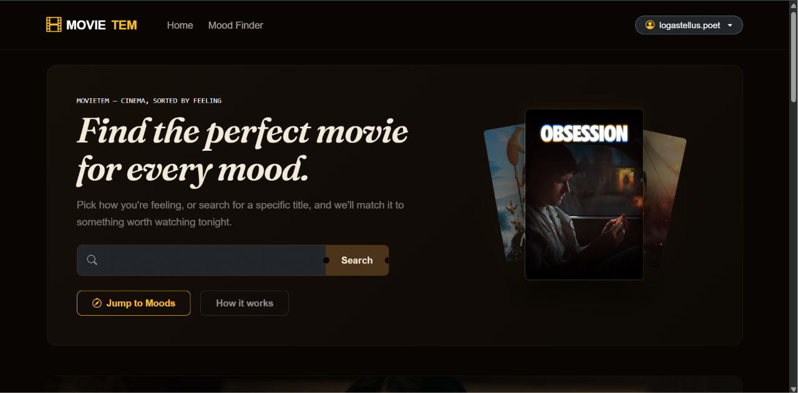

# 🎬 MovieTem

**Cinema, sorted by feeling.**

MovieTem is a mood-based movie discovery platform. Instead of scrolling through endless grids of titles, pick how you feel — happy, mind-bending, chill, nostalgic — and get matched with something worth watching tonight. Rate what you watch, and MovieTem learns your taste to recommend more of it.


  Add 2-3 screenshots here once your site is running. Example:
  im
  
  


---

## ✨ Features

- **Mood-based discovery** — twelve curated moods (Happy, Horror Night, Sci-Fi, Nostalgic, and more) each mapped to a genre profile, pulling live results from TMDB.
- **Personalized recommendations ("Picked for You")** — the standout feature. MovieTem analyzes a user's highest-rated movies, computes a weighted genre affinity score, and surfaces titles matching their actual taste — excluding anything already rated or watchlisted. Genre data is cached at rating time so recommendations load fast without hammering the TMDB API.
- **Live search with autocomplete** — debounced, real-time title suggestions as you type.
- **Watchlist** — one-click bookmarking, persisted per user, with poster/rating/year data stored locally so the watchlist page never needs to re-query TMDB.
- **Star ratings & reviews** — rate any movie 1–5 stars with an optional written review; reopening a movie shows your existing rating pre-filled.
- **Movie detail modal** — synopsis, runtime, trailer link, and regional streaming availability (powered by TMDB's watch-provider data).
- **Trending carousel** — auto-refreshing showcase of what's popular today.
- **Authentication** — registration, login, and account settings, with hashed passwords and CSRF-protected forms throughout.

## 🛠️ Tech Stack

| Layer | Technology |
|---|---|
| Backend | PHP (vanilla, PDO for database access) |
| Database | MySQL / MariaDB |
| Frontend | HTML, vanilla JavaScript (fetch API), Bootstrap 5.3 |
| External API | [The Movie Database (TMDB)](https://www.themoviedb.org/) |
| Fonts | Fraunces, Inter, JetBrains Mono (Google Fonts) |

No frameworks, no build step — clone it and run it on any standard PHP/MySQL stack (XAMPP, MAMP, or a LAMP server).

## 🧠 How the Recommendation Engine Works

1. When a user rates a movie, MovieTem fetches that movie's genres from TMDB once and stores them alongside the rating.
2. To generate recommendations, it pulls the user's 4★+ rated movies and computes a weighted genre score (a 5★ rating counts more than a 4★ one).
3. It queries TMDB separately for each of the user's top 3 genres, then interleaves the results round-robin — so one dominant genre doesn't flood every recommendation slot.
4. Anything the user has already rated or watchlisted is filtered out before display.

This means recommendations get more accurate the more a user rates, and never repeat data they've already engaged with.

## 📁 Project Structure

```
movietem/
├── api/                        # JSON endpoints consumed by app.js
│   ├── get_movie_details.php
│   ├── get_movies_by_mood.php
│   ├── get_recommendations.php
│   ├── get_user_rating.php
│   ├── save_rating.php
│   ├── submit_review.php
│   └── toggle_watchlist.php
├── assets/
│   ├── css/styles.css
│   └── js/app.js
├── config/
│   ├── database.example.php    # copy to database.php and fill in your credentials
│   └── tmdb.example.php        # copy to tmdb.php and add your TMDB API key
├── includes/
│   ├── header.php
│   └── footer.php
├── index.php
├── login.php / register.php / logout.php
├── profile.php
├── watchlist.php
└── schema.sql                  # full database schema
```

## 🚀 Setup

**Requirements:** PHP 7.4+, MySQL/MariaDB, a [free TMDB API key](https://www.themoviedb.org/settings/api).

1. **Clone the repo**
   ```bash
   git clone https://github.com/bluesky2912/Movie_Tem.git
   cd Movie_Tem
   ```

2. **Create your local config files** (these are gitignored — the repo only ships `.example.php` templates)
   ```bash
   cp config/database.example.php config/database.php
   cp config/tmdb.example.php config/tmdb.php
   ```
   Edit `config/database.php` with your MySQL credentials, and `config/tmdb.php` with your TMDB API key.

3. **Create the database**
   ```sql
   CREATE DATABASE movietem;
   ```
   Then import the schema:
   ```bash
   mysql -u root -p movietem < schema.sql
   ```

4. **Serve the app** — point your local server (XAMPP/MAMP/`php -S`) at the project root and visit `index.php`.

5. **Register an account**, rate a few movies 4★ or higher, and watch the "Picked for You" section populate on the homepage.

## 🔒 Security Notes

- All database queries use PDO prepared statements — no raw string interpolation.
- Every state-changing endpoint (`toggle_watchlist.php`, `save_rating.php`, `submit_review.php`) validates a per-session CSRF token before acting.
- Passwords are hashed with `password_hash()` / verified with `password_verify()` — never stored in plaintext.
- Real credentials (`config/database.php`, `config/tmdb.php`) are gitignored; only placeholder `.example.php` templates are committed.

## 🗺️ Possible Next Steps

- Content-rating filters on discovery/recommendation results
- Pagination on search and mood results (currently capped at the first page)
- Public shareable watchlist links
- Password reset flow

## 🙏 Attribution

This product uses the TMDB API but is not endorsed or certified by TMDB.


This project was built as a college project and is available for educational reference.