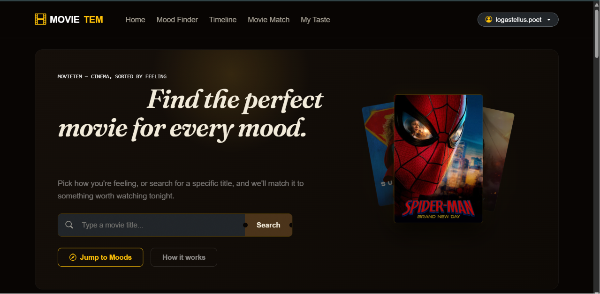
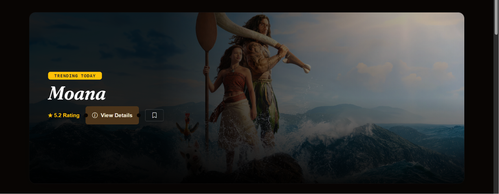
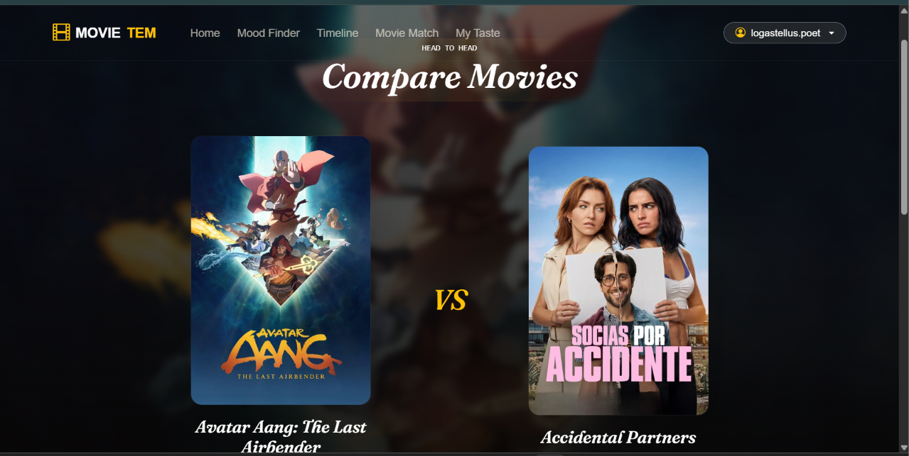
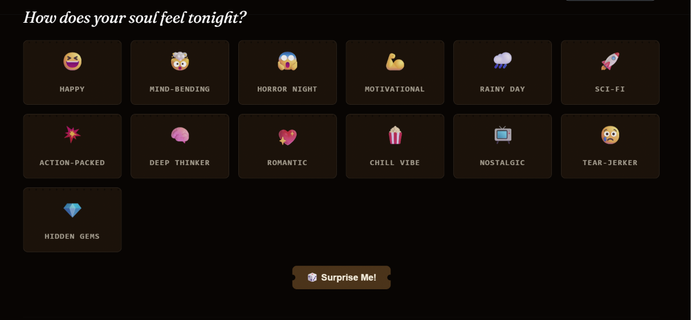
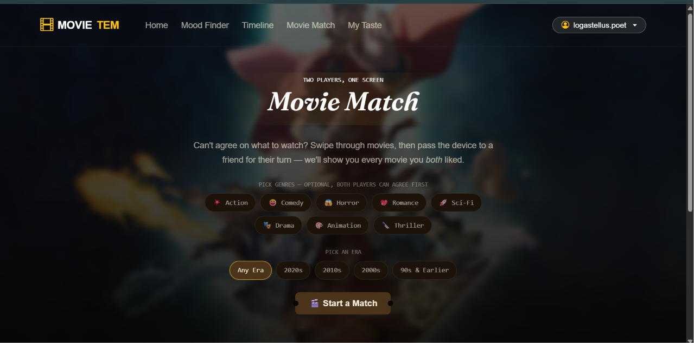
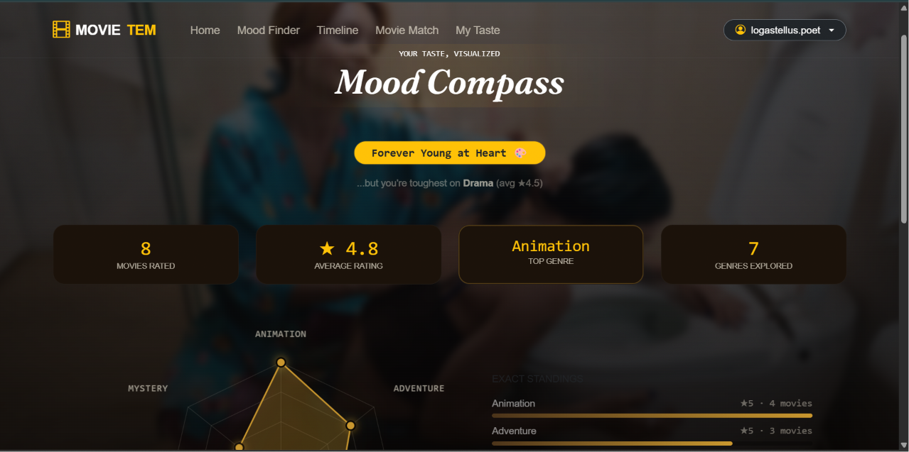
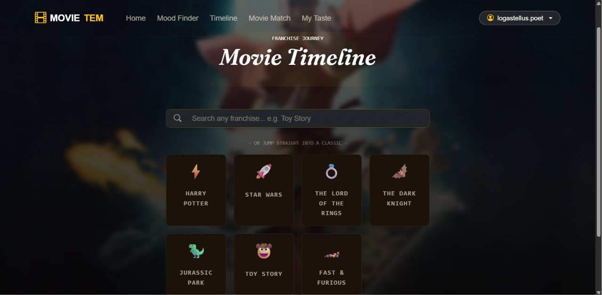
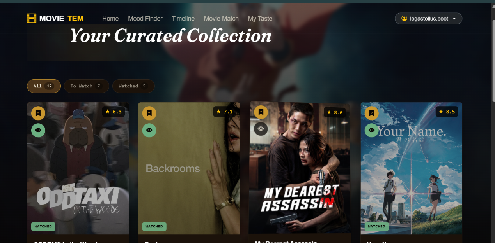

<div align="center">

# 🎬 MOVIE TEM

**Cinema, sorted by feeling.**

*A film print, not a dashboard.*

</div>

Most movie sites hand you a wall of tiles and wish you luck. MovieTem asks how you're actually feeling tonight — happy, mind-bending, chill, nostalgic, or thirteen other moods — and hands back something worth pressing play on. Rate what you watch and it learns your taste, plots that taste back at you as a shape, and can even settle the eternal argument of *what do we watch together* without anyone storming off to bed.

No frameworks. No build step. Just PHP, vanilla JS, and a lot of attention paid to how a real cinema *feels* — grain, sprocket holes, ticket-stub buttons, marquee brass — instead of another Bootstrap template with a dark mode toggle.

  
  
  
  
  
  
  
  
  
  

---

## 🎟️ Now Showing

### Discovery
- **Mood-based discovery** — thirteen curated moods (Happy, Horror Night, Sci-Fi, Nostalgic, Hidden Gems, and more), each its own genre profile or dedicated query pulling live results from TMDB. Pick a feeling, not a filter.
- **Hidden Gems** — the one mood that doesn't play by the popularity rules. It hunts for films rated 7.5+ that stayed under 20,000 votes — the good stuff the algorithm usually buries.
- **Picked for You** — the recommendation engine, and the closest thing MovieTem has to a house specialty. It weighs your highest-rated movies by genre, skips anything you've already seen or saved, and gets sharper the more you rate.
- **Live search with autocomplete** — type a title, get real suggestions, debounced so it doesn't hammer TMDB on every keystroke.
- **Trending carousel** — what's playing today, with a slow Ken Burns zoom so even a static backdrop feels like it's breathing.

### Your Collection
- **Watchlist** — one click to bookmark, no re-fetching TMDB every time you check it.
- **Mark as Watched** — a second toggle that splits "want to watch" from "already seen," with filter tabs and live counts so your shelf actually stays organized.
- **Star ratings & reviews** — 1 to 5 stars, an optional review, pre-filled the next time you open something you've already rated.
- **The movie modal** — synopsis, runtime, trailer, and streaming availability. Click a provider badge (Netflix, Prime, Hotstar, whatever's showing) and it sends you to *that provider's own* search page for the title — not a generic aggregator link pretending to be helpful.

### Compare & Explore
- **Compare Movies** — pick two off any grid, get them head-to-head: rating, vote count, popularity, runtime, budget, revenue, and any cast they share.
- **Movie Timeline** — search a franchise, watch it lay itself out as a connected timeline from first film to latest. Real TMDB Collections data, not a guess.

### Together
- **Movie Match** — the feature that actually earns the tagline. Two players, one device, a shared shuffled deck. Swipe, pass it over, swipe again — whatever you both hearted gets revealed, confetti included. Optional genre and era filters mean it's not just popularity roulette.

### Your Taste, On Screen
- **Mood Compass** — your rating history turned into a radar chart. Top genres plotted as a shape, exact per-genre averages, a full 1★–5★ breakdown of your rating habits, and an honest "you're toughest on ___" callout that doesn't flatter you.

### The Basics, Done Right
- Registration, login, account settings — hashed passwords, CSRF tokens on every form that changes something.

---

## 🎥 The Look & The Motion

MovieTem's whole visual language comes from an actual cinema, not a UI kit: film grain, sprocket-hole edges, a ticket-stub notch on every primary button, marquee gold reserved for hover and emphasis. Then there's the motion layered on top of it:

- **A rotating backdrop** of real top-rated posters, blurred and dimmed, crossfading behind several pages
- **Titles that type themselves in**, letter by letter, like an opening credit
- **Scroll reveal** — content sharpens into focus as it enters view, like a lens racking focus, alternating a slight tilt so nothing marches in uniformly
- **Cursor-tilt on cards** — mood cards, movie cards, stat cards all lean toward your mouse
- **The signature moment**: the movie modal doesn't fade in, it opens like a projector iris
- **Toasts, confetti, sparkle bursts** — every genuine win (a save, a 5-star rating, a Movie Match) gets a small reward instead of a browser `alert()`
- A hidden easter egg on the logo, for anyone patient enough to click it five times

Everything above respects `prefers-reduced-motion`. Atmosphere is the goal, not seasickness.

---

## 🎞️ Behind the Scenes (Tech Stack)

| Layer | Technology |
|---|---|
| Backend | PHP (vanilla, PDO for database access) |
| Database | MySQL / MariaDB |
| Frontend | HTML, vanilla JavaScript (fetch API), Bootstrap 5.3 |
| External API | [The Movie Database (TMDB)](https://www.themoviedb.org/) |
| Fonts | Fraunces, Inter, JetBrains Mono (Google Fonts) |

No frameworks, no build step — clone it, point a standard PHP/MySQL stack at it (XAMPP, MAMP, or a LAMP server), and it runs.

## 🎬 Director's Commentary: How the Recommendation Engine Works

1. Rate a movie, and MovieTem quietly fetches its genres from TMDB once and caches them alongside the rating.
2. To build recommendations, it pulls your 4★+ rated movies and computes a weighted genre score — a 5★ counts for more than a 4★.
3. It queries TMDB separately for your top 3 genres and interleaves the results round-robin, so one obsession doesn't flood every slot.
4. Anything already rated or watchlisted gets filtered out before it ever reaches the screen.

The more you rate, the sharper it gets. It never shows you the same thing twice.

## 🧭 Director's Commentary: How Mood Compass Works

1. Pulls every rating you've made, along with the genre data cached at rating time — same data the recommendation engine already leans on.
2. Computes a weighted score per genre, and a genuine average per genre (score ÷ number of movies rated in it).
3. Your top 7 genres become the axes of a hand-built SVG radar chart — no charting library, just server-side trigonometry doing the drawing.
4. A "toughest on" callout names the genre with your lowest average (minimum 2 ratings in it, so one harsh review can't unfairly brand a whole genre), and a rating-habits bar shows exactly how generous — or not — you actually are.

Needs at least 3 rated movies with cached genre data to render. Fewer than that, and it says so honestly instead of faking a chart.

## 🤝 Director's Commentary: How Movie Match Works

1. Both players can agree on genre tags and/or an era before starting — this builds a filtered TMDB `discover` query instead of a generic popularity pool.
2. A shuffled 16-movie deck gets fetched once and shared between both players.
3. Player 1 swipes — drag the card or tap ✕ / ❤ — likes tracked in memory only.
4. A "pass the device" screen hands off to Player 2, who swipes the identical deck blind, with no idea what Player 1 picked.
5. Anything you both liked gets revealed as a match, confetti and all. Zero overlap gets an honest "wildly different taste" message and a one-tap reshuffle — no fake matches, ever.

## 📁 Project Structure

```
movietem/
├── api/                          # JSON endpoints consumed by app.js
│   ├── get_background_movies.php # Backdrops for the cinematic rotating background
│   ├── get_hidden_gems.php       # Highly-rated, low-vote-count discovery
│   ├── get_match_deck.php        # Shuffled deck for Movie Match (genre/era aware)
│   ├── get_movie_details.php
│   ├── get_movies_by_mood.php
│   ├── get_recommendations.php
│   ├── get_user_rating.php
│   ├── save_rating.php
│   ├── search_collections.php    # Franchise/collection search for Timeline
│   ├── submit_review.php
│   ├── toggle_watched.php        # Mark as Watched toggle
│   └── toggle_watchlist.php
├── assets/
│   ├── css/styles.css
│   ├── images/                   # Favicon set (svg, multi-size png, apple-touch-icon)
│   └── js/app.js
├── config/
│   ├── database.example.php      # copy to database.php and fill in your credentials
│   └── tmdb.example.php          # copy to tmdb.php and add your TMDB API key
├── includes/
│   ├── header.php
│   └── footer.php
├── screenshots/                  # README preview images
├── compare.php                   # Head-to-head movie comparison
├── favicon.ico
├── index.php
├── login.php / register.php / logout.php
├── match.php                     # Movie Match swipe game
├── profile.php
├── taste.php                     # Mood Compass taste radar
├── timeline.php                  # Franchise movie timeline
├── watchlist.php
└── schema.sql                    # full database schema
```

## 🎫 Setup (Buying Your Ticket)

**Requirements:** PHP 7.4+, MySQL/MariaDB, a [free TMDB API key](https://www.themoviedb.org/settings/api).

1. **Clone the repo**
   ```bash
   git clone https://github.com/bluesky2912/Movie_Tem.git
   cd Movie_Tem
   ```

2. **Create your local config files** (these are gitignored — the repo only ships `.example.php` templates)
   ```bash
   cp config/database.example.php config/database.php
   cp config/tmdb.example.php config/tmdb.php
   ```
   Edit `config/database.php` with your MySQL credentials, and `config/tmdb.php` with your TMDB API key.

3. **Create the database**
   ```sql
   CREATE DATABASE movietem;
   ```
   Then import the schema:
   ```bash
   mysql -u root -p movietem < schema.sql
   ```
   Note: `genre_ids` (used by recommendations and Mood Compass) and `is_watched` (used by the watchlist toggle) should be present as columns on `movie_ratings` and `watchlist` respectively — check your live schema matches `schema.sql` before relying on those features, since the two can drift out of sync as the app evolves.

4. **Serve the app** — point your local server (XAMPP/MAMP/`php -S`) at the project root and visit `index.php`.

5. **Register an account**, rate a few movies 4★ or higher, and watch "Picked for You" populate on the homepage — then check **My Taste** in the nav once you've rated a handful more.

## 🔒 Security & Reliability

- Every database query runs through PDO prepared statements — no raw string interpolation, anywhere.
- Every state-changing endpoint checks a per-session CSRF token before it acts.
- Passwords are hashed with `password_hash()`, verified with `password_verify()` — never stored in plaintext.
- Real credentials (`config/database.php`, `config/tmdb.php`) are gitignored; only placeholder `.example.php` templates are committed.
- TMDB requests automatically retry (up to 3 attempts, with backoff) on transient network failures, and force TLS 1.2 / IPv4 / HTTP1.1 to work around a common connection-reset issue on older PHP/cURL/OpenSSL combinations.
- API endpoints surface the *real* underlying error — the actual TMDB message or cURL failure reason — instead of silently returning an empty result. A genuine outage should never look identical to "nothing found."

## 🎟️ Coming Attractions

- Password reset flow
- TMDB response caching (fewer live calls, more insulation against connectivity hiccups)
- Pagination / infinite scroll on mood and search results (currently capped at TMDB's first page)
- Genre/rating filter chips on the main Mood Finder and search results (Movie Match already has this)
- Public shareable watchlist links
- Public review feed — see what everyone's saying about a movie, not just your own rating
- Content-rating filters on discovery and recommendation results

## 🙏 Attribution

This product uses the TMDB API but is not endorsed or certified by TMDB.


---

*Built as a college project. House lights up, credits roll — available for educational reference.*